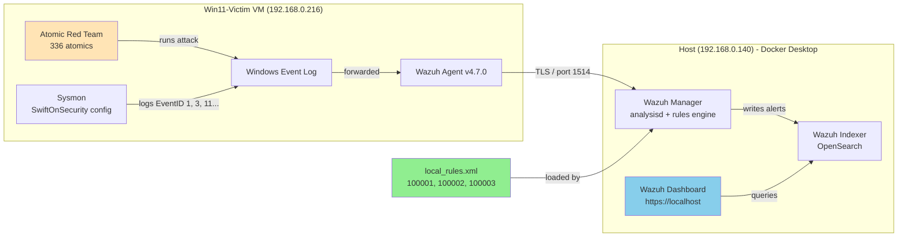
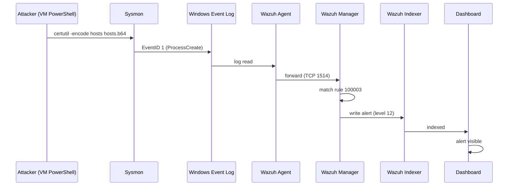

# Architecture

```mermaid
flowchart LR
    subgraph VM["Win11-Victim VM (192.168.0.216)"]
        ART[Atomic Red Team<br/>336 atomics]
        SYS[Sysmon<br/>SwiftOnSecurity config]
        AGENT[Wazuh Agent v4.7.0]
        ART -- "runs attack" --> EVT[Windows Event Log]
        SYS -- "logs EventID 1, 3, 11..." --> EVT
        EVT -- "forwarded" --> AGENT
    end

    subgraph HOST["Host (192.168.0.140) - Docker Desktop"]
        MGR[Wazuh Manager<br/>analysisd + rules engine]
        IDX[Wazuh Indexer<br/>OpenSearch]
        DASH[Wazuh Dashboard<br/>https://localhost]
        MGR -- "writes alerts" --> IDX
        DASH -- "queries" --> IDX
    end

    AGENT -- "TLS / port 1514" --> MGR
    RULES[local_rules.xml<br/>100001, 100002, 100003] -- "loaded by" --> MGR

    style ART fill:#ffe4b5
    style RULES fill:#90ee90
    style DASH fill:#87ceeb
```

## Telemetry path for a detection

```mermaid
sequenceDiagram
    participant A as Attacker (VM PowerShell)
    participant S as Sysmon
    participant E as Windows Event Log
    participant W as Wazuh Agent
    participant M as Wazuh Manager
    participant I as Wazuh Indexer
    participant D as Dashboard

    A->>S: certutil -encode hosts hosts.b64
    S->>E: EventID 1 (ProcessCreate)
    E->>W: log read
    W->>M: forward (TCP 1514)
    M->>M: match rule 100003
    M->>I: write alert (level 12)
    I->>D: indexed
    D->>D: alert visible
```
